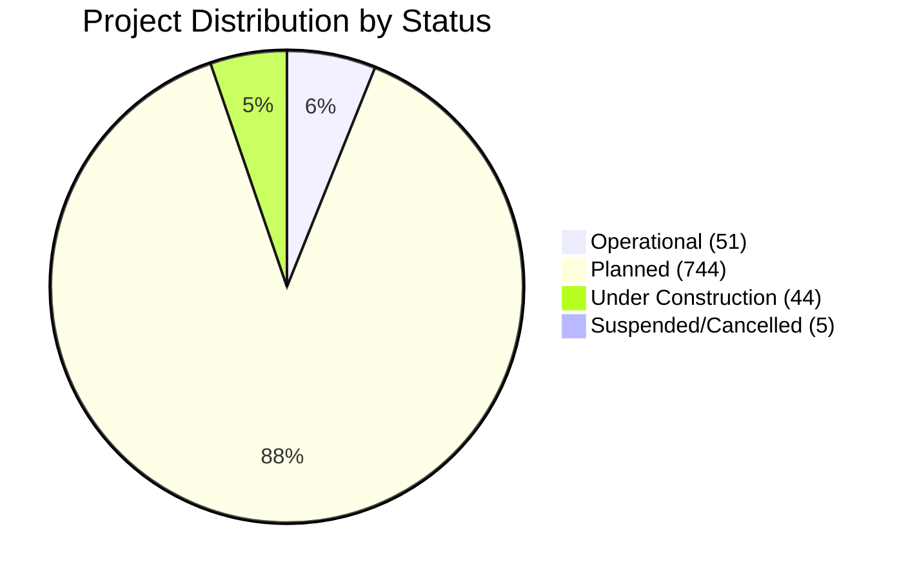
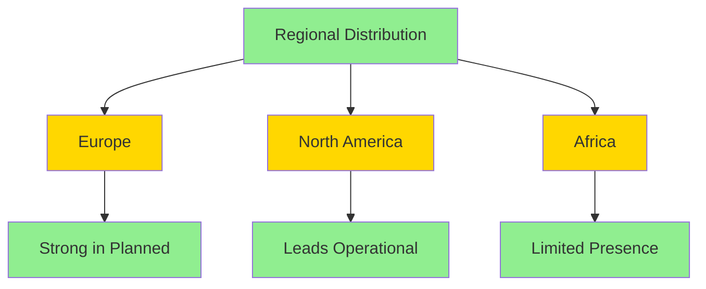
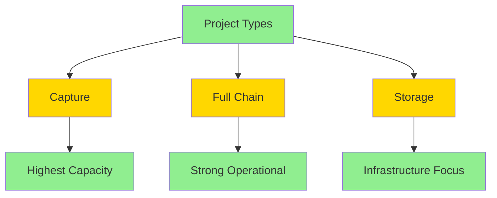

# 🌍 Global Carbon Removal Projects Analysis

## 📊 Executive Summary

> An analysis of global carbon removal initiatives, examining distribution, capacity, status, and sectoral focus across regions. Current data reveals significant variations in project maturity, regional concentration, and technological approaches.

## 🎯 Key Metrics

### Overall Portfolio Statistics


| Metric | Value |
|--------|--------|
| Total Projects | 844 |
| Total Capacity | 2,225 Mt CO2/yr |
| Primary Regions | Europe, North America |

## 📈 Project Status Breakdown

### 1. Operational Projects


### 2. Planned Projects


### 3. Under Construction


### 4. Suspended/Cancelled


## 🗺️ Regional Distribution

### Key Findings


## 🏭 Sectoral Analysis

### Primary Sectors
1. **Transport & Storage**
   - [x] Present in all project statuses
   - [x] Critical infrastructure component
   - [x] Enables other technologies

2. **Power and Heat**
   - [x] Major decarbonization driver
   - [x] Wide geographical presence
   - [x] High capacity potential

3. **Industrial Applications**
   ```mermaid
   graph LR
       A[Industrial] --> B[Chemicals]
       A --> C[Iron/Steel]
       A --> D[LNG]
       style A fill:#90EE90
       style B fill:#FFD700
       style C fill:#FFD700
       style D fill:#FFD700
   ```

## ⚙️ Project Type Analysis

### Distribution by Type


## 🚧 Challenges and Opportunities

### Challenges
- [ ] Geographic Imbalance
- [ ] Implementation Gaps
- [ ] Technology Concentration

### Opportunities
- [x] Market Expansion Potential
- [x] Cross-sector Integration
- [x] Capacity Scaling

## 💡 Recommendations

1. ### Geographic Diversification
   ```mermaid
   graph LR
       A[Geographic Strategy] --> B[Incentives]
       A --> C[Knowledge Share]
       A --> D[Regional Focus]
       style A fill:#90EE90
       style B fill:#FFD700
       style C fill:#FFD700
       style D fill:#FFD700
   ```

2. ### Project Support
   - Regulatory frameworks
   - Development methodologies
   - Financial mechanisms

3. ### Innovation Focus
   - Technology diversity
   - Pilot projects
   - R&D investment

## 📝 Conclusion

The global carbon removal landscape shows:
1. Strong potential in planned projects
2. Geographic concentration challenges
3. Need for implementation support
4. Opportunity for strategic expansion

---

### Repository Information
- 📅 Last Updated: October 29, 2024
- 📊 Data Source: IEA, CCUS Projects Database, IEA, Paris https://www.iea.org/data-and-statistics/data-product/ccus-projects-database

---

### Contributing
Feel free to contribute to this analysis by:
1. Opening an issue
2. Submitting a pull request
3. Suggesting additional metrics

---

### License
This analysis is licensed under [MIT License](LICENSE.md)

---

<div align="center">
    
    <p><em>Building a sustainable future through carbon removal innovation</em></p>
</div>
